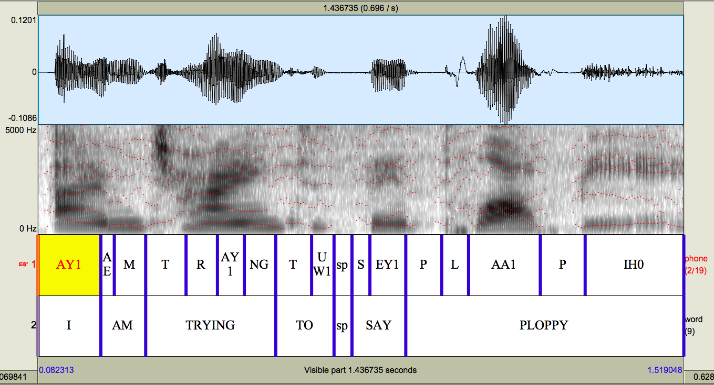
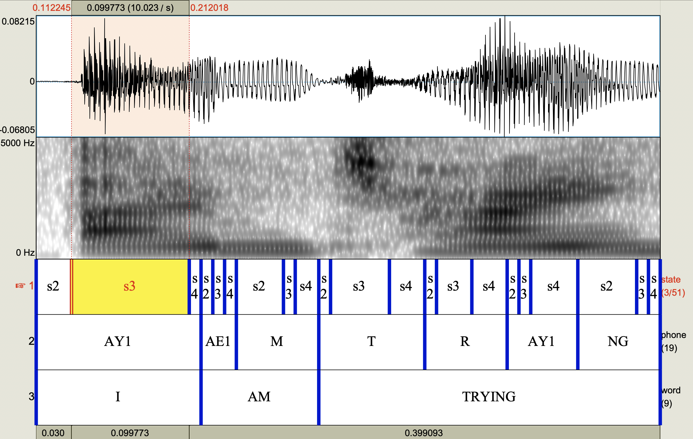

# P2FA for Python3.x

This is a modified version of P2FA for Python3 compatibility.
Everything else remains the same as the original P2FA.
Forced alignment helps to align linguistic units (e.g., phoneme or
words) with the corresponding sound file. All you need is to have a
sound file with a transcription file.
The output will be .TextGrid file with time-aligned phone, word and
optionally state-level tiers.

This was tested on macOS Catalina and Arch Linux.

## Install HTK
First, you need to download HTK source code (http://htk.eng.cam.ac.uk/).
This HTK installation guide is retrieved from
[Link](https://github.com/prosodylab/Prosodylab-Aligner).
Installation is based on macOS Sierra.

**Note:** I couldn't run HTK-3.4.1 on Arch Lmaek
inux. I switched to 3.4.0
and everything works fine. Installation of HTK is the same as the one
described below.

Unzip HTK-3.4.1.tar.gz file

```bash
$ tar -xvf HTK-3.4.1.tar.gz
```

After extracting the tar file, switch to htk directory.

```bash
$ cd htk
```

Compile HTK in the htk directory.

```bash
$ export CPPFLAGS=-UPHNALG
$ ./configure --disable-hlmtools --disable-hslab
$ make clean    # necessary if you're not starting from scratch
$ make -j4 all
$ sudo make -j4 install
```

**Note:** For macOS, you may need to follow these steps before compiling HTK:

```bash
# Add CPPFLAGS
$ export CPPFLAGS=-I/opt/X11/include

# If the above doesn't work, do 
$ ln -s /opt/X11/include/X11 /usr/local/include/X11

# Replace line 21 (#include <malloc.h>) of HTKLib/strarr.c as below
#   include <malloc/malloc.h> 

# Replace line 1650 (labid != splabid) of HTKLib/HRec.c as below
#   labpr != splabid
# This step will prevent "ERROR [+8522] LatFromPaths: Align have dur<=0"
# See: https://speechtechie.wordpress.com/2009/06/12/using-htk-3-4-1-on-mac-os-10-5/

# Compile with options if necessary
$ ./configure
$ make all
$ make install
```


## Install sox

```bash
$ sudo apt-get install sox

# or in Arch

$ sudo pacman -S sox

# or using brew

$ brew install sox
```

## Run

### stand alone

```bash
$ python align.py examples/ploppy.wav examples/ploppy.txt examples/ploppy.TextGrid
```

### as part of your code

You can invoke the aligner from your code:

```python
from p2fa import align

phoneme_alignments, word_alignments = align.align('WAV_FILE_PATH', 'TRANSCRIPTION_FILE_PATH')

# or 

phoneme_alignments, word_alignments, state_alignments = align.align('WAV_FILE_PATH', 'TRANSCRIPTION_FILE_PATH', state_align=True)
```

## Result



With state-alignments



## References
- http://www.ling.upenn.edu/phonetics/p2fa/
- Jiahong Yuan and Mark Liberman. 2008. Speaker identification on the SCOTUS corpus. Proceedings of Acoustics '08.
- https://github.com/prosodylab/Prosodylab-Aligner (P2FA seems better than Prosodylab-Aligner based on my qualitative evaluation)
- English HMM-state level aligner: [Link](https://github.com/jaekookang/p2fa_state_aligner)
- Korean Forced Aligner: [Link](https://github.com/EMCSlabs/Programs/tree/master/Korean_FA) from EMCSLabs.
